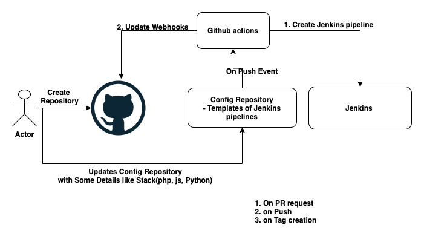

# Jenkins Pipeline creation Automation

Simple python scripts for automating jenkins pipeline creation

### Pre-requisites

- Assuming already jenkins installed and configured
- Jenkins is accessible to Github
- Generic web-hook trigger plugin installed

